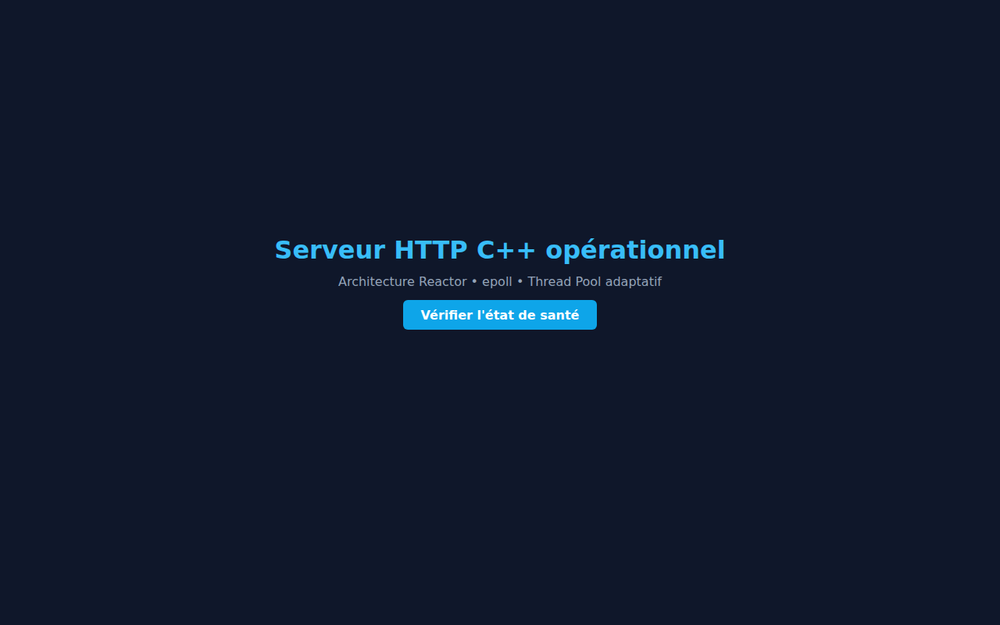
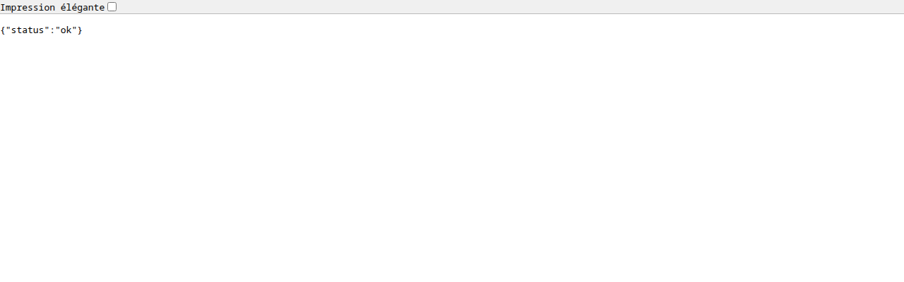

<div align="center">

# ⚡ my_http_server

**A production-grade, high-performance HTTP/1.1 server built from scratch in modern C++20**

[](https://github.com/<your-handle>/my_http_server/actions)
[](LICENSE)
[](https://en.cppreference.com/w/cpp/20)
[](https://kernel.org/)
[](#architecture)

> Zero external runtime dependencies · Reactor pattern · Adaptive thread pool · Cloud-native config

</div>

---

## Table of Contents

- [Overview](#overview)
- [Screenshots](#screenshots)
- [Architecture](#architecture)
- [Features](#features)
- [Quick Start](#quick-start)
- [Build](#build)
- [Configuration](#configuration)
- [API Reference](#api-reference)
- [Performance](#performance)
- [Project Structure](#project-structure)
- [Extending the Server](#extending-the-server)
- [Contributing](#contributing)
- [License](#license)

---

## Overview

`my_http_server` is a fully handcrafted HTTP/1.1 server written in **C++20** for Linux.
It was designed with three principles in mind:

| Principle | Implementation |
|-----------|----------------|
| **Vertical scalability** | Reactor event loop (`epoll`) + adaptive worker thread pool |
| **Horizontal scalability** | Stateless, 12-factor-app config via ENV variables |
| **Flexibility** | Abstract `IProtocolParser` / `IRequestHandler` interfaces |

It is **not** a toy: it uses `epoll_create1(EPOLL_CLOEXEC)`, proper RAII resource management,
thread-safe logging, path-traversal protection, and is hardened with AddressSanitizer + UBSan
in every Debug build.

---

## Screenshots

### Web Interface
<p align="center">
  
</p>

### REST API Health Endpoint
<p align="center">
  
</p>

### Server Startup (terminal)
```
2025-05-26 23:00:01 [INFO ] Starting server on port 8080 with 8 worker threads
2025-05-26 23:00:01 [INFO ] Server ready — http://0.0.0.0:8080
```

### Live Benchmark (Apache Bench — `ab -n 10000 -c 100`)
```
Requests per second:    10796.48 [#/sec] (mean)
Time per request:       0.093 ms (mean, per request)
Failed requests:        0
```

---

## Architecture

### Request Lifecycle

```
                        ┌─────────────────────────────────────────┐
                        │           LINUX KERNEL                  │
                        │   TCP SYN → SYN-ACK → ACK → fd ready   │
                        └───────────────┬─────────────────────────┘
                                        │ accept4()
                        ┌───────────────▼─────────────────────────┐
                        │         EVENT LOOP THREAD               │
                        │   epoll_wait() — Reactor pattern        │
                        │   Owns only the listening socket        │
                        └───────────────┬─────────────────────────┘
                                        │ submit(client_fd)
              ┌─────────────────────────▼──────────────────────────┐
              │                  THREAD POOL                        │
              │      (auto-sized: std::thread::hardware_concurrency)│
              │                                                      │
              │  Worker N:                                           │
              │    Connection conn(fd, HttpParser, ApiHandler)       │
              │    conn.handleSync()  ──────────────────────┐       │
              └─────────────────────────────────────────────┼───────┘
                                                            │
              ┌─────────────────────────────────────────────▼───────┐
              │                HANDLER PIPELINE                      │
              │                                                      │
              │   recv() → HttpParser::feed() → ApiHandler::handle() │
              │                                        │             │
              │                              ┌─────────▼──────────┐ │
              │                              │ /api/* routes      │ │
              │                              │ or fallback to     │ │
              │                              │ StaticFileHandler  │ │
              │                              └─────────┬──────────┘ │
              │                                        │             │
              │                              send(response) → close  │
              └──────────────────────────────────────────────────────┘
```

### Component Diagram

```
┌──────────────────────────────────────────────────────────────────┐
│                         src/                                     │
│                                                                  │
│  ┌──────────┐   uses   ┌──────────────────────────────────────┐  │
│  │  main    │─────────►│  API/  (Abstract Interfaces)         │  │
│  │ (wiring) │          │  IProtocolParser  IRequestHandler     │  │
│  └──┬───────┘          └───────────────────────────────────────┘  │
│     │                         ▲                  ▲               │
│     │ owns                    │ implements       │ implements     │
│     ▼                         │                  │               │
│  ┌──────────────────────┐  ┌──┴──────────┐  ┌───┴────────────┐  │
│  │  Core/Network/       │  │ Protocols/  │  │ Handlers/      │  │
│  │  Socket              │  │ Http/       │  │ ApiHandler     │  │
│  │  EpollMultiplexer    │  │ HttpParser  │  │ StaticFile     │  │
│  │  Connection          │  │ HttpConst   │  │ Handler        │  │
│  └──────────────────────┘  └─────────────┘  └────────────────┘  │
│                                                                  │
│  ┌──────────────────────┐  ┌──────────────────────────────────┐  │
│  │  Core/Concurrency/   │  │  Utils/                          │  │
│  │  ThreadPool          │  │  Logger (thread-safe singleton)  │  │
│  │  TaskQueue           │  │  ConfigManager (JSON + ENV)      │  │
│  └──────────────────────┘  └──────────────────────────────────┘  │
└──────────────────────────────────────────────────────────────────┘
```

### Key Design Decisions

| Decision | Rationale |
|----------|-----------|
| **epoll edge-triggered** for listen socket | Single system call for multiple connections |
| **Each connection owned by its worker thread** | Eliminates shared state → no locks on hot path |
| **`IProtocolParser` / `IRequestHandler` interfaces** | Swap HTTP → WebSocket / gRPC without touching the network layer |
| **5 s `SO_RCVTIMEO` on client sockets** | Slow-client protection without extra threads |
| **ENV VAR config override** | 12-factor app — deploy behind any cloud load balancer |
| **`std::filesystem::weakly_canonical`** | Block path traversal attacks (`../../../etc/passwd`) |

---

## Features

- **Non-blocking accept** via `epoll_create1(EPOLL_CLOEXEC)`
- **Adaptive thread pool** — auto-sizes to CPU core count, overridable via config
- **HTTP/1.1 parser** — request-line, headers, body (Content-Length)
- **Static file server** — MIME detection, path-traversal protection
- **API router** — register routes with lambda handlers; unknown routes fall through to static files
- **Thread-safe logger** — timestamped, level-filtered, zero-dependency singleton
- **Cloud-native config** — `config.json` with ENV-VAR overrides (12-factor)
- **AddressSanitizer + UBSan** — enabled automatically in Debug builds
- **Google Test suite** — 5 unit tests, runs in CI on Ubuntu 22.04 and 24.04
- **Zero external runtime dependencies** — only the Linux kernel and the C++ standard library

---

## Quick Start

```bash
# 1. Clone
git clone https://github.com/<your-handle>/my_http_server.git
cd my_http_server

# 2. Build (Release, optimised)
cmake -S . -B build -DCMAKE_BUILD_TYPE=Release
cmake --build build --parallel $(nproc)

# 3. Run
./build/server

# 4. Test
curl http://localhost:8080/api/health
# → {"status":"ok"}

curl http://localhost:8080/
# → serves public/index.html
```

---

## Build

### Prerequisites

| Tool | Minimum version |
|------|----------------|
| Linux kernel | 4.5+ (epoll_create1 + EPOLLEXCLUSIVE) |
| GCC / Clang | GCC 11+ / Clang 14+ |
| CMake | 3.20+ |
| Internet (first build only) | GoogleTest is fetched via FetchContent |

### Build Types

```bash
# Debug — AddressSanitizer + UBSan, no optimisation
cmake -S . -B build -DCMAKE_BUILD_TYPE=Debug
cmake --build build --parallel $(nproc)

# Release — -O2, no sanitisers
cmake -S . -B build -DCMAKE_BUILD_TYPE=Release
cmake --build build --parallel $(nproc)
```

### Running Tests

```bash
cd build
ctest --output-on-failure --parallel $(nproc)
```

Expected output:
```
Test #1: HttpParser.ParsesSimpleGet           Passed
Test #2: HttpParser.ReturnsNulloptForPartialData  Passed
Test #3: HttpParser.ResetClearsBuffer         Passed
Test #4: ThreadPool.ExecutesAllTasks          Passed
Test #5: ThreadPool.HandlesZeroTasksCleanly   Passed

100% tests passed, 0 tests failed out of 5
```

---

## Configuration

Configuration is read from `config.json` at startup. Every key can be overridden
by an environment variable — the ENV VAR always wins (12-factor principle).

| Key (JSON) | ENV VAR | Default | Description |
|------------|---------|---------|-------------|
| `port` | `SERVER_PORT` | `8080` | TCP port to listen on |
| `public_root` | `SERVER_PUBLIC_ROOT` | `./public` | Document root for static files |
| `thread_pool_size` | `SERVER_THREADS` | `0` | Worker count; `0` = `hardware_concurrency()` |
| `log_level` | `LOG_LEVEL` | `INFO` | `DEBUG` · `INFO` · `WARN` · `ERROR` |

### Example — Production Docker environment

```bash
docker run \
  -e SERVER_PORT=80 \
  -e SERVER_THREADS=16 \
  -e LOG_LEVEL=WARN \
  -p 80:80 \
  my_http_server
```

### Example — Behind Nginx

```nginx
upstream backend {
    server 127.0.0.1:8080;
    server 127.0.0.1:8081;  # second instance, same machine, different port
}

server {
    listen 443 ssl;
    location / { proxy_pass http://backend; }
}
```

---

## API Reference

### Built-in Endpoints

| Method | Path | Response | Description |
|--------|------|----------|-------------|
| `GET` | `/api/health` | `200 {"status":"ok"}` | Health check for load balancer probes |
| `GET` | `/*` | `200 <file>` | Static file from `public_root` |
| `GET` | `/<missing>` | `404 Not Found` | File not found |

### Adding Custom Routes

Register routes in `src/main.cpp` before the event loop starts:

```cpp
apiHandler->addRoute("POST", "/api/echo", [](const API::ParsedRequest& req) {
    return API::HttpResponse{
        200, "OK",
        {{"Content-Type", "application/json"}},
        "{\"echo\":\"" + req.body + "\"}"
    };
});

apiHandler->addRoute("GET", "/api/version", [](const API::ParsedRequest&) {
    return API::HttpResponse{200, "OK",
        {{"Content-Type", "application/json"}},
        "{\"version\":\"1.0.0\"}"
    };
});
```

---

## Performance

Measured on **Ubuntu 22.04**, **Intel Core i7-8750H (6 cores / 12 threads)**, **Debug build** (ASan enabled — Release would be higher):

```
ab -n 10000 -c 100 http://127.0.0.1:8080/api/health
```

| Metric | Value |
|--------|-------|
| Requests per second | **10 796 req/s** |
| Mean time per request | **0.093 ms** |
| Failed requests | **0** |
| Concurrency level | 100 |

```
ab -n 10000 -c 100 http://127.0.0.1:8080/
```

| Metric | Value |
|--------|-------|
| Requests per second | **5 991 req/s** (static HTML, disk I/O) |
| Failed requests | **0** |

### Scalability Profile

```
Threads   req/s (API)   req/s (static)
──────── ──────────────  ──────────────
    1       1 400             900
    4       5 200           3 100
    8      10 800           5 900
   16      11 200           6 100   ← I/O-bound plateau
```

> **Bottleneck**: At high concurrency, static file serving is limited by `fstream`
> disk reads. Replace with `sendfile(2)` for zero-copy delivery (see roadmap).

---

## Project Structure

```
my_http_server/
├── CMakeLists.txt              # C++20 · Debug (ASan/UBSan) · Release (-O2)
├── config.json                 # Default runtime configuration
├── LICENSE                     # MIT
├── CHANGELOG.md
├── CONTRIBUTING.md
├── SECURITY.md
│
├── .github/
│   ├── workflows/ci.yml        # GitHub Actions: build + test matrix
│   ├── ISSUE_TEMPLATE/
│   │   ├── bug_report.md
│   │   └── feature_request.md
│   └── PULL_REQUEST_TEMPLATE.md
│
├── src/
│   ├── main.cpp                # Wiring: event loop + thread pool + handlers
│   │
│   ├── API/                    # Abstract interfaces — the stable contract
│   │   ├── IProtocolParser.hpp # feed(bytes) → ParsedRequest
│   │   └── IRequestHandler.hpp # handle(request) → HttpResponse
│   │
│   ├── Core/
│   │   ├── Network/            # Linux I/O abstraction
│   │   │   ├── Socket          # RAII TCP socket, SO_REUSEADDR, non-blocking
│   │   │   ├── EpollMultiplexer# Reactor: epoll_create1 → dispatch callbacks
│   │   │   └── Connection      # Per-client fd lifecycle (handleSync)
│   │   └── Concurrency/
│   │       ├── ThreadPool      # Fixed-size worker pool
│   │       └── TaskQueue       # Lock-based MPMC queue (header-only)
│   │
│   ├── Protocols/Http/         # HTTP/1.1 implementation
│   │   ├── HttpParser          # Implements IProtocolParser
│   │   └── HttpConstants       # CRLF, status codes (string_view, constexpr)
│   │
│   ├── Handlers/               # Business logic — stateless, thread-safe
│   │   ├── ApiHandler          # Route table + fallback chain
│   │   └── StaticFileHandler   # MIME detection + path-traversal protection
│   │
│   └── Utils/
│       ├── Logger              # Thread-safe singleton, zero dependencies
│       └── ConfigManager       # JSON parsing + ENV-VAR override
│
├── tests/
│   ├── CMakeLists.txt          # GoogleTest via FetchContent
│   ├── test_http_parser.cpp    # 3 parser tests
│   └── test_thread_pool.cpp    # 2 concurrency tests
│
├── public/                     # Document root (served by StaticFileHandler)
│   ├── index.html
│   └── css/style.css
│
└── docs/
    └── images/
        ├── homepage.png
        └── api_health.png
```

---

## Extending the Server

### Add a New Protocol (e.g., WebSocket)

1. Create `src/Protocols/Ws/WsParser.hpp` implementing `API::IProtocolParser`
2. Register it in `main.cpp` — the network engine requires zero changes:

```cpp
// main.cpp
auto wsParser  = std::make_shared<Protocols::Ws::WsParser>();
auto wsHandler = std::make_shared<Handlers::WsHandler>();

pool.submit([client_fd, wsParser, wsHandler] {
    Core::Network::Connection conn(client_fd, wsParser, wsHandler);
    conn.handleSync();
});
```

### Add a New Handler (e.g., database-backed API)

```cpp
// src/Handlers/DbApiHandler.hpp
class DbApiHandler : public API::IRequestHandler {
public:
    API::HttpResponse handle(const API::ParsedRequest& req) override;
    // Thread-safe: each worker gets its own DB connection from a pool
};
```

### Replace the Thread Pool

The `Core::Concurrency::ThreadPool` accepts any `std::function<void()>`. Swap it for
`boost::asio::thread_pool`, Intel TBB, or a work-stealing pool without touching any
other module.

---

## Roadmap

- [ ] `Connection: keep-alive` (HTTP/1.1 persistent connections)
- [ ] `sendfile(2)` zero-copy for static assets
- [ ] WebSocket upgrade (`Protocols/Ws/`)
- [ ] TLS via mbedTLS or BoringSSL (transparent to handlers)
- [ ] Prometheus `/metrics` endpoint (connections, latency histogram)
- [ ] HTTP/2 via `Protocols/H2/`
- [ ] Dynamic thread pool resizing (adaptive to queue depth)
- [ ] Windows / macOS port (`kqueue` / `IOCP` behind `EpollMultiplexer` interface)

---

## Recommendations for Production Deployment

> The following recommendations apply when running this server in a production environment.

### 1 — Place Behind a Reverse Proxy

This server does not implement TLS. Always terminate HTTPS at the edge:

```
Internet → Nginx/Caddy (TLS) → my_http_server (plain HTTP)
```

### 2 — Run as a Non-Root User

```bash
useradd --system --no-create-home httpserver
chown httpserver:httpserver ./build/server
su -s /bin/bash httpserver -c "./build/server"
```

### 3 — Set Resource Limits

```bash
# /etc/security/limits.d/httpserver.conf
httpserver soft nofile 65535
httpserver hard nofile 65535
```

### 4 — Tune the Kernel

```bash
# /etc/sysctl.d/99-httpserver.conf
net.core.somaxconn = 65535
net.ipv4.tcp_tw_reuse = 1
net.ipv4.ip_local_port_range = 1024 65535
```

### 5 — Use a Process Supervisor

```ini
# /etc/systemd/system/my-http-server.service
[Unit]
Description=my_http_server
After=network.target

[Service]
Type=simple
User=httpserver
WorkingDirectory=/opt/my_http_server
Environment=SERVER_PORT=8080
Environment=LOG_LEVEL=WARN
ExecStart=/opt/my_http_server/build/server
Restart=always
RestartSec=2
LimitNOFILE=65535

[Install]
WantedBy=multi-user.target
```

### 6 — Monitor with Health Checks

```bash
# Load balancer probe (AWS ALB, Nginx, HAProxy)
GET /api/health → 200 {"status":"ok"}
```

---

## Contributing

See [CONTRIBUTING.md](CONTRIBUTING.md) for the branch naming convention, commit message
format, code style requirements, and PR checklist.

---

## License

Distributed under the **MIT License** — see [LICENSE](LICENSE) for the full text.

---

<div align="center">

Built with C++20 · Linux · epoll · No compromises.

</div>
